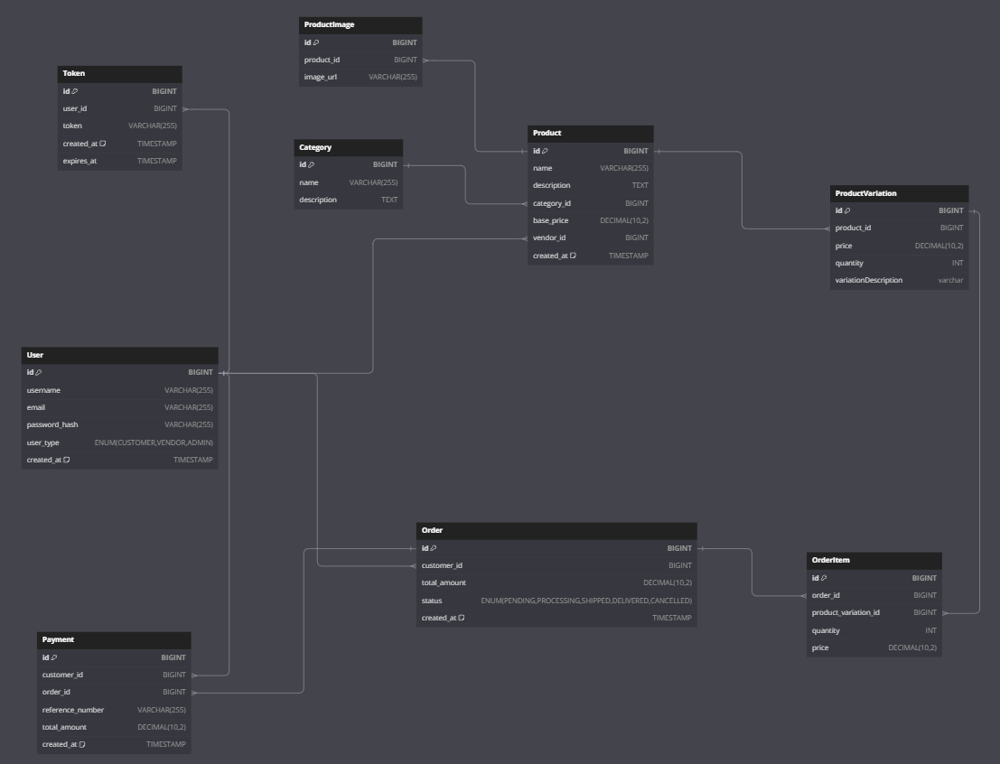

# BlissCart E-commerce Backend

BlissCart is an e-commerce backend application. This README outlines the key features, architectural decisions, and technologies used in developing the project
## Table of Contents

- [Overview](#overview)
- [Features](#features)
- [Architecture](#architecture)
- [Database Design](#database-design)
- [Frontend Integration](#frontend-integration)
- [Design Considerations](#database-design)

- [Deployment and CI/CD](#deployment-and-cicd)
- [Technologies Used](#technologies-used)

## Overview
BlissCart is a Spring Boot-based backend for an e-commerce platform. It’s built to handle core functionalities like user management, product catalogs, order processing, and payments.

The backend focuses on scalability and maintainability, making sure it can adapt to growing demands. It’s designed to ensure smooth and secure transactions, efficient handling of user data, and overall robust performance.

## Features

### User Authentication & Authorization:

- JWT-based authentication ensures secure access to the API.
- Role-based access control for different user types (admin, customer).

### Product Management:
 
- Supports product categories, variations, and inventory tracking.
- Each product can have multiple variations (e.g., size, color), allowing for a rich and flexible product catalog.
- Efficient pagination and filtering enable users to easily browse products based on their preferences.

## Architecture

### Layered Architecture
The backend follows a layered architecture:

### Controller Layer:

 Manages HTTP requests and responses.
 Serves as the entry point to the API, mapping endpoints to service methods.
 
 ### Service Layer:

 Contains business logic and orchestrates between different layers.
 Ensures separation of concerns, making the system more modular.

### Repository Layer:

 Handles data persistence using Spring Data JPA.
 Interfaces with the PostgreSQL database for CRUD operations.

## Database Design
The database schema supports the core functionalities of the e-commerce platform. Below is a diagram illustrating the current structure:

For the latest version of the database design, you can check the updated diagram here at [dbdiagram.io](https://dbdiagram.io/d/blisscart-66b3f5a48b4bb5230e8573cc)

## Frontend Integration
 
BlissCart has a client (customer) side and is developed as a Kotlin-based mobile application. This mobile app provides users with an intuitive and responsive interface to interact with the e-commerce platform.

### Mobile App Integration

Technology: The mobile app is built using Kotlin, leveraging modern Android development practices and libraries to ensure a smooth user experience.

Features:
- Product Browsing: Users can browse products, view details, and manage their cart.
- Order Management: Users can place orders, track their status, and view order history.
- Authentication: Secure user login and registration with JWT integration for seamless interaction with the backend.
  
For more details on the mobile app and its implementation, visit the [Blisscart-Mobile](https://github.com/Brian-Mulei/BlissCart-Android).

## Design Considerations

### Product Variations
BlissCart is designed to manage products with multiple variations efficiently. This feature is essential for an e-commerce platform where products can come in different sizes, colors, or configurations. Here’s how product variations are handled:

- Variation Handling:

Each product can have multiple variations, such as different sizes for clothing or different colors for electronics.
Variations are treated as separate entities with unique attributes, such as price and stock level. This allows for precise inventory management and better user experience.
- Database Structure:

Products and their variations are stored in separate tables, with foreign key relationships to maintain data integrity.
The product table includes basic product details, while the variation table stores specific attributes for each variation, such as size and color.
- User Experience:

On the product details page, users can select different variations from dropdowns or selection boxes. The application dynamically updates the price, stock availability, and other details based on the selected variation.

## Deployment and CI/CD
- Automated Testing: Implemented an action to run run all test when the main development is updated and after all test pass, it updates the deployment branch.
- Continuous Deployment: Once the deployment branch is updated, Github actions pushes changes to the server using ssh and restarts the application within the Docker container.

## Technologies Used
- Spring Boot: For building the RESTful API.
- PostgreSQL: As the relational database for storing application data.
- Docker: For containerization and ease of deployment.
- GitHub Actions: For setting up CI/CD pipelines.
- JWT: For secure authentication and authorization.
